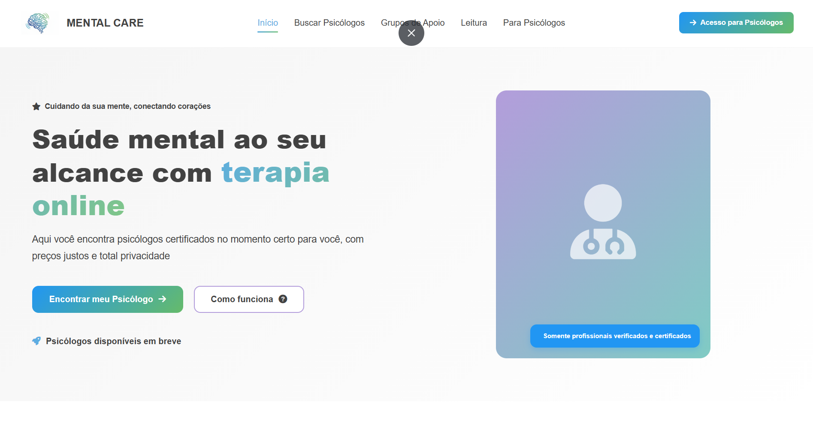
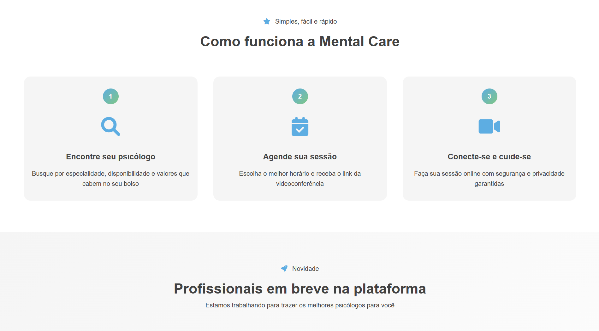
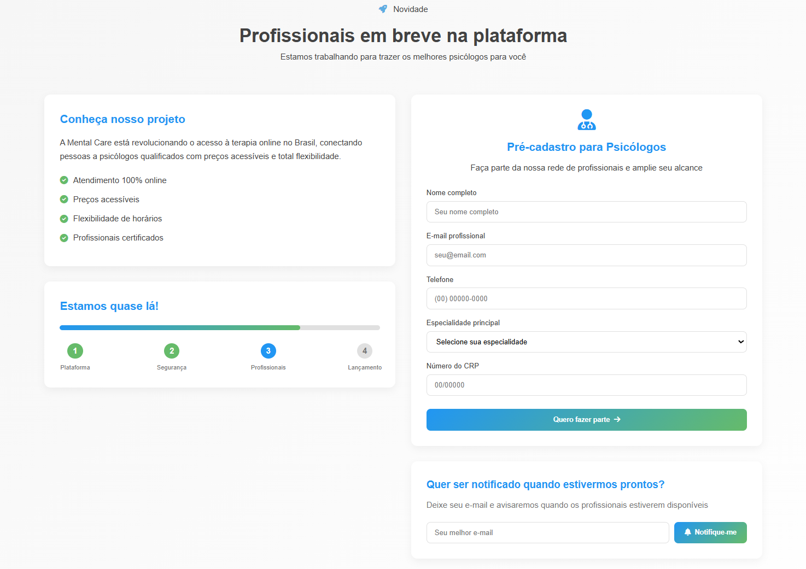
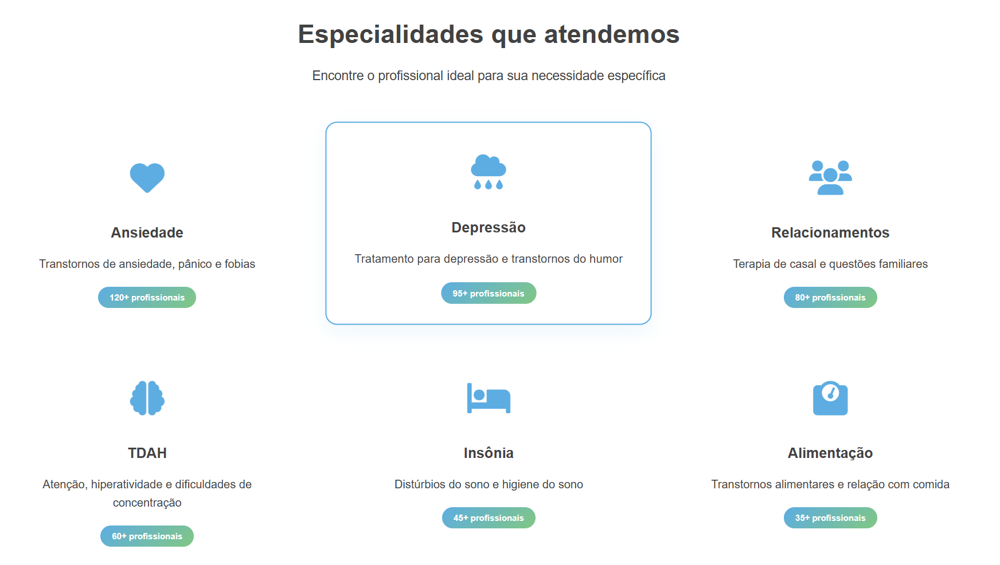
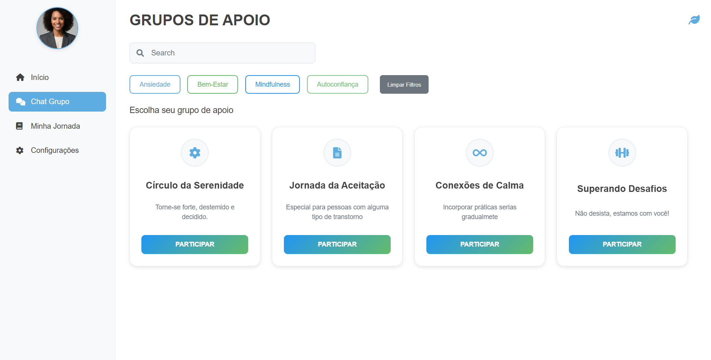

# Mental Care
Bem-vindo ao repositório oficial do Mental Care, uma plataforma digital voltada ao cuidado da saúde mental e bem-estar emocional. O objetivo deste projeto é oferecer um ambiente seguro, intuitivo e acolhedor para usuários iniciarem sua jornada de autoconhecimento, autocuidado e, futuramente, acesso a profissionais especializados.

🚧 Status do Projeto
Este projeto está em desenvolvimento. Em breve, funcionalidades como cadastro de profissionais e interação em tempo real ficarão disponíveis.

✨ Funcionalidades previstas
Cadastro e login de usuários

Registro e acompanhamento do humor diário

Página inicial com dicas, mensagens motivacionais e progresso

Seção de grupos de apoio (em desenvolvimento)

Página de perfil do usuário

Interface moderna e responsiva

Integração futura com profissionais da área de saúde mental

📸 
## Tela inicial

## Funcionalidade

## Informações

## Especialidades

## Grupos - Apoio

📄 Licença
Este projeto está licenciado sob a licença MIT. Veja o arquivo LICENSE para mais informações.

# Em breve, novas funcionalidades, integrações e conteúdos serão adicionados. Obrigado por apoiar o Mental Care!